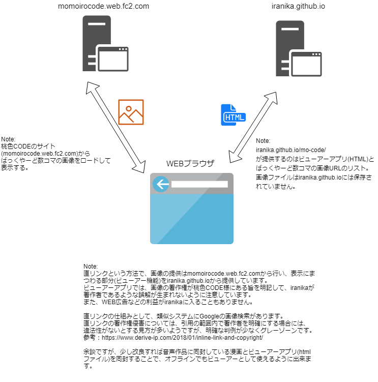

# mo-code

## これはなに？

桃色コードというサークルのバックヤード4コマ漫画のビュアーです。  
仕組みとして、画像データは[桃色CODE様のサイト](http://momoirocode.web.fc2.com/)から直リンクで参照しており、ローカルには一切保存していません。

## 仕組み

いわゆる直リンクを利用して、画像を引用しています。

## 著作権について

画像データの著作権は桃鳥様にあります。注意してください。
なお、ビュアーは桃鳥様より許諾を得て公開しております。

ビュアーアプリに関しては、iranika.github.ioのLICENSEが適応されます。
