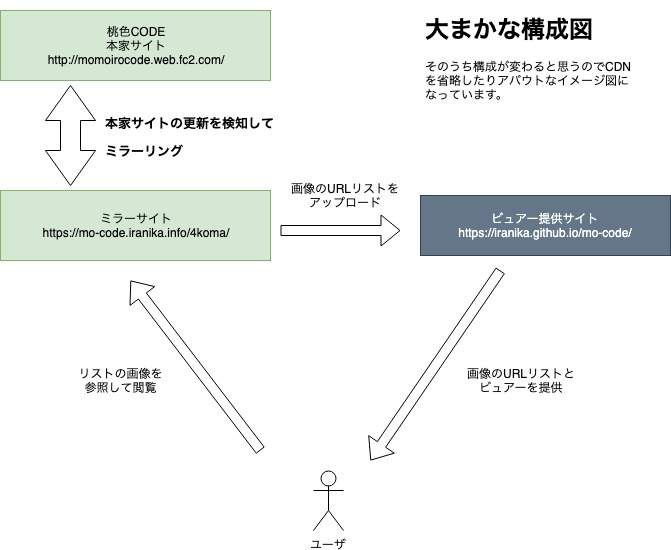

# mo-code

## これはなに？

[桃色CODE様のサイト](http://momoirocode.web.fc2.com/)のバックヤード4コマ漫画を見るためのビュアーです。  
こちらで提供・公開中↓  
https://iranika.github.io/mo-code/

なお提供・公開にあたっては著作者の桃鳥様より一切の許諾を得ております。

## 仕組み

桃色CODE様のミラーサイト(画像)をCDN(CloudFlare)経由で公開しており、  
github.ioで提供しているビュアーはミラーサイトの画像を直リンクで参照しています。  

ミラーサイトのサーバ単体だけでもビュアーを公開できますが、  
github.ioのほうが安定してホスティングできるので、現状はこのような構成にしています。  

※ミラーサイトのサーバはiranikaの個人的な試験評価環境なので安定稼働を保証していません。  
※画像の提供に関してはCDNを経由させているのである程度は安心です。  

イメージとしてはこんな感じ  
(たぶん構成は変わるのでCDNとかは省略しています)  

## 便利な機能

URLのアンカー(ハッシュ)を利用して、特殊なアクセス方法を提供しています。    
* 最新話を表示  
https://iranika.github.io/mo-code/#latest
* 指定話数(例：24話)を表示  
https://iranika.github.io/mo-code/#24

なお、特殊なアクセスの場合にはモーダルの表示を抑制しています。  

## 著作権について

ビュアーアプリに関しては、本リポジトリのLICENSEが適応されます。  
画像データの著作権は桃鳥様にあります。注意してください。  
ビュアーの仕組みなどを含めて、提供・公開にあたっては著作者の桃鳥様より許諾を得ております。  
ビュアーについて何かあれば[いらにかのTwitter](https://twitter.com/happy_packet)まで御連絡ください。  

## 寄付について

支援したい物好きな方のために寄付も受け付けております。  
Kyash, 楽天ペイ, PayPay等(Amazonギフト券でもOK)  
金額よりも支援の気持ちが何より嬉しいので、数円でも小躍りしちゃいます。  
寄付についての詳細は[こちら](https://github.com/iranika/iranika.github.io)